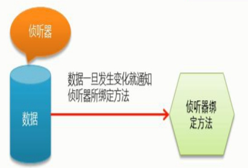

**样式绑定相关语法细节**
```
1. 对象绑定和数组绑定可以结合使用
2. class绑定的值可以简化操作
3. 默认的class如何处理?默认的class会保留
```
**3.6样式绑定**
```javascript
1. class样式处理
	* 对象语法
	<div v-bind:class="{active:isActive}"></div>
	* 数组语法
	<div v-bind:class="{activeClass,errorClass}"></div>
2. style样式处理
	* 对象语法
	<div v-bind:style="{color:activeColor,fontSize:fontSize}"></div>
	* 数组语法
	<div v-bind:style="[baseStyle,overridingStyles]"></div>
```

### 3.7 分支循环结构

1. 分支结构
	* v-if
	* v-else
	* v-else-if
	* v-show
2. v-if与v-show的区别
	* v-if控制元素是否渲染到页面
	* v-show控制元素是否显示(已经渲染到了页面)

**v-show的原理:控制元素样式是否显示display:none**

3. 循环结构
	* v-for遍历数组

```javascript
	<li v-for='item in list'>{{item}}</li>
	<li v-for='(item,index) in list'>{{item}}+'---'+{{index}}</li>
```

**key的作用:帮助Vue区分不同的元素,从而提高性能,自定义加上id的唯一属性,进行标记.**

```javascript
	<li :key='item.id' v-for='(item,index) in list'>{{item}} + '---' + {{index}}</li>
```

4. 循环结构

```javascript
	* v-for遍历对象
	<div v-for='(value,key,index) in object'></div>
	* v-if和v-for结合使用
	<div v-if='value==12' v-for='(value,key,index) in object'></div>
```

### 5.0表单域操作

1. v-model获取表单数据
2. 表单域修饰符
	* number:转化为数值
	* trim:去掉开始和结尾的空格
	* lazy:将input事件切换为change事件

### 5.3自定义指令

1. 为何需要自定义指令?
	* 内置指令不满足需求
2. 自定义指令的语法规则(获取元素焦点)

```javascript
	注册一个全局自定义指令 v-focus
	Vue.directive("focus", {
		//当被绑定的元素插入到DOM 中时……
		inserted: function(el) {
			//聚焦元素
			el.focus();
		}
	});
```

3. 自定义指令用法

```javascript
<input type="text" v-focus>
```

4. 钩子函数

```
<!-- 当绑定的元素插入到DOM中时……
	 钩子函数它本身就是一个函数 他不是我们调用的 它是vue给我们调用 只不会他们调用的时机不一样
	 
 -->
一个指令定义对象可以提供如下几个钩子函数(均为可选):
* bind:只调用一次,指令第一次绑定到元素时调用,在这里可以进行一次性的初始化设置.
* inserted:被绑定元素插入父节点时调用(仅保证父节点存在,但不一定已被插入文档中).
* update:所在组件的VNode更新时调用,但是可能发生在其子VNode更新之前,指令的值可能发生了改变,也可能没有,但是你可以通过比较更新前后的值来忽略下不必要的模板更新(详细的钩子函数参数见下).
* componentUpdated:指令所在组件的VNode及其子VNode全部更新后调用.
* unbind:只调用一次,指令与元素解绑时调用.
```

### 5.4计算属性

1. 为何需要计算属性?
	* 表达式的计算逻辑可能会比较复杂,使用计算属性可以使模板内容更加简洁
2. 计算属性的用法

```javascript
computed:{
	reversedMessage:function(){
		return this.msg.split('').reverse().join('')
	}
}
```

3. 计算属性与方法的区别
	* 计算属性是基于它们的依赖进行缓存的
	* 方法不存在缓存

### 5.Vue常用特性

**5.5侦听器**

1. 侦听器的应用场景
	* 数据变化时执行异步或开销较大的操作



